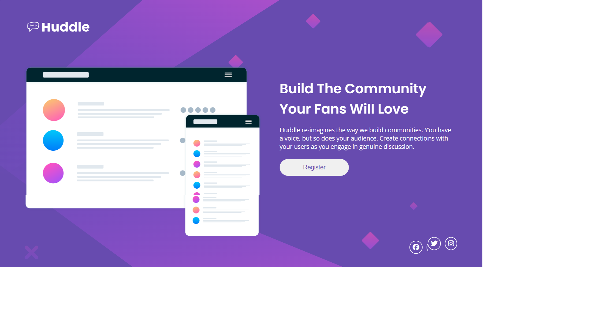
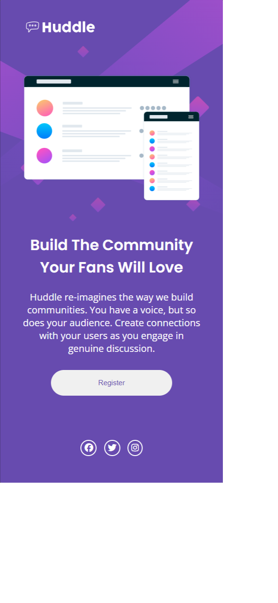

# Huddle - Desafio DevQuest

Este é um desafio lançado no curso DevQuest baseado no frontend mentor.

## Índice

- [Visao Geral](#visao-geral)
  - [O desafio](#o-desafio)
  - [Screenshot](#screenshot)
  - [Links](#links)
- [My process](#my-process)
  - [Constuido com](#built-with)
  - [Desenvolvimento continuo](#continued-development)

## Visao Geral

### O desafio

O principal desafio nesse projeto foi o fluxo de trabalho para dispositivos móveis, assim também como o uso de tags semânticas no HTML e o uso do CSS para da um visual agradável a quem está visitando a página.

### Screenshot

[
  

  
]

### Links
- Live Site URL: https://your-live-site-url.com

## My process

### Construído com

- HTML 
- CSS
- Flexbox
- Fluxo de trabalho voltado para dispositivos móveis

### Desenvolvimento contínuo

Continuar aperfeiçoando o HTML assim como o css, mas com um maior foco em javascript para uma melhor interação do usuário com a página.